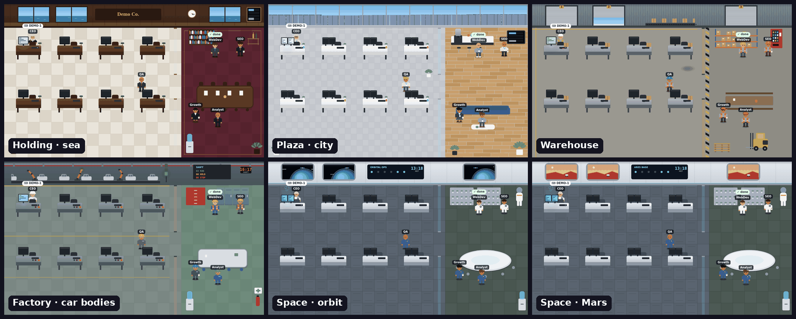
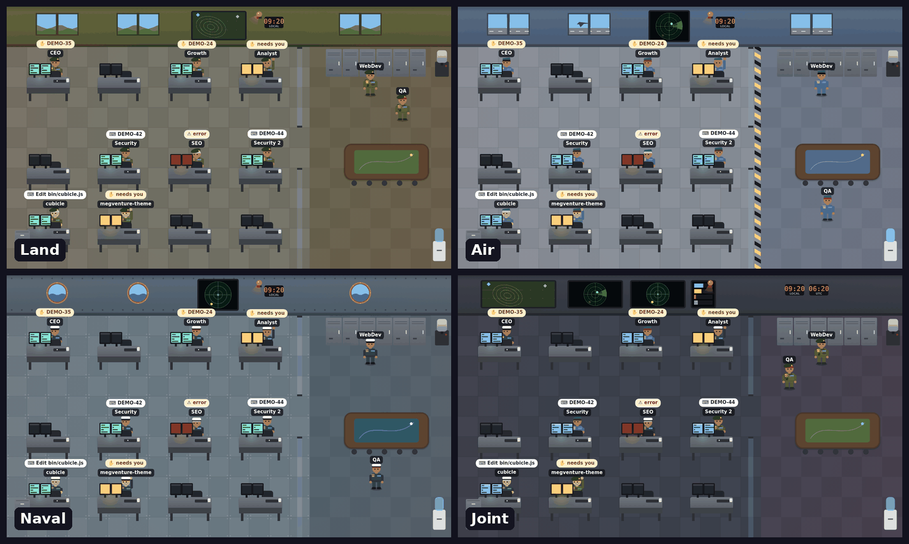
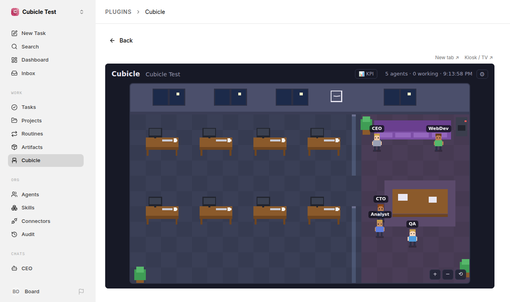

# Cubicle

**A live pixel-art office for your AI agents.** Works with [Paperclip](https://github.com/paperclipai/paperclip), [Claude Code](https://claude.com/claude-code), or any tool that can write a small JSON file.

**[▶ Live demo](https://caglarutkuguler.github.io/cubicle/?lang=en)** — no install, fake agents.

[](https://www.npmjs.com/package/@caglarutkuguler/cubicle) [](https://github.com/caglarutkuguler/cubicle/actions/workflows/ci.yml)  [](LICENSE)

Your agents get a desk. When one starts working it walks over, sits down and starts typing, with its current task floating above its head. When it needs you, it raises a hand. When it finishes it goes back to the lounge for a coffee. If it hits an error, its screen flashes red.

[](https://caglarutkuguler.github.io/cubicle/?lang=en)

- **Zero dependencies.** One small Node.js file plus one HTML page. No build step, no image assets.
- **Read-only by design.** Cubicle only ever makes `GET` requests, and only to a short allowlist. It cannot change anything in your agent system.
- **Not tied to one platform.** Paperclip, Claude Code, Codex CLI and Gemini CLI are built in; anything else plugs in through a [tiny JSON feed](docs/FEED.md).
- **Runs anywhere Node runs.** `npx`, a clone, a systemd unit, or a browser tab pointed at the hosted demo.
- **Themes.** The classic pixel office, or HD rooms: a holding HQ, a plaza office, a warehouse, a factory, a space base and a military operations room. Pick one from the ⚙ menu; a theme is one file anyone can add.
- **English, Turkish, German, Spanish and French UI**, picked from your browser language or with `?lang=xx`.

## Quick start

Requires Node.js 18+.

**Paperclip** (default; expects Paperclip at `http://127.0.0.1:3100`):

```bash
npx @caglarutkuguler/cubicle
```

**Inside Paperclip** — as a plugin, with its own menu entry and no separate server:

```bash
npx paperclipai plugin install @caglarutkuguler/cubicle
```

Open **Cubicle** in Paperclip's sidebar. Details in [Inside Paperclip](#inside-paperclip).

**Claude Code** (one character per session, driven by Claude Code's own hooks; details in [`examples/claude-code/`](examples/claude-code/)):

```bash
npx @caglarutkuguler/cubicle install-hooks      # once; backs up ~/.claude/settings.json first
npx @caglarutkuguler/cubicle --source claude-code
```

**Both in one office** — Paperclip agents on the first rows, Claude Code sessions after them:

```bash
npx @caglarutkuguler/cubicle --source paperclip,claude-code
```

**Anything else** — a JSON file or URL in the [feed format](docs/FEED.md):

```bash
npx @caglarutkuguler/cubicle --source ./agents.json
npx @caglarutkuguler/cubicle --source http://localhost:8080/agents
```

Then open <http://127.0.0.1:3200>. Nothing running yet? Open <http://127.0.0.1:3200/?demo>, or the [hosted demo](https://caglarutkuguler.github.io/cubicle/?lang=en).

Or from a clone:

```bash
git clone https://github.com/caglarutkuguler/cubicle.git
cd cubicle
node bin/cubicle.js            # add --source … as above
```

## Options

| Flag | Environment variable | Default |
| --- | --- | --- |
| `--port` | `CUBICLE_PORT` | `3200` |
| `--host` | `CUBICLE_HOST` | `127.0.0.1` |
| `--source` | `CUBICLE_SOURCE` | `paperclip` — or `claude-code`, `codex`, `gemini`, `replay:FILE.jsonl`, a `.json` file, an `http(s)://` URL, or several of these comma-separated |
| `--paperclip` | `PAPERCLIP_URL` | `http://127.0.0.1:3100` |
| `--token-file` | `PAPERCLIP_TOKEN` / `PAPERCLIP_TOKEN_FILE` | none — API key for an authenticated Paperclip |
| `--redact` | `CUBICLE_REDACT=1` | off — strip task titles, commands and error text on the server; the office shows only ids, tool names and statuses |
| `--record FILE.jsonl` | | off — append everything the office shows to a file, only when it changes |
| `--speed N` | `CUBICLE_SPEED` | `60` — replay speed for `--source replay:FILE.jsonl` (60 = an hour a minute) |

URL parameters:

- `?company=PREFIX` opens a specific Paperclip company (for example `?company=MEG`). With several companies, a picker also appears in the header.
- `?lang=en`, `tr`, `de`, `es` or `fr` sets the language.
- `?demo` shows fake agents.
- `?theme=military&branch=land` picks a theme and its options (listed in [`public/themes/index.json`](public/themes/index.json)). The same choices are in the ⚙ menu, which remembers them per browser and copies a link that carries them, so a kiosk always opens the same way.
- `?kiosk` fills the screen with the office for a TV or a second monitor (run the server with `--redact` if that screen is shared): cards and footer hidden, names and bubbles scale with the screen, cursor hidden. Combined with the auto-updater, a wall display picks up new versions by itself.

## What the office shows

| Status | In the office |
| --- | --- |
| `running` | Sits at its desk, monitor on, typing; bubble shows the task |
| `waiting` | Sits at its desk with a hand up, amber screen — it needs your input or approval. With Paperclip this comes from issues whose review is waiting on the board (for example pending ask-user questions); a busy agent keeps typing but its bubble flashes the issue id, and the header counts how many need you |
| `idle` | Wanders the lounge; says "✓ done" right after finishing a run |
| `error` | Slumped at its desk, red screen, error text on its card |
| `paused` | "zZ" |

## Themes

[](https://caglarutkuguler.github.io/cubicle/?lang=en&theme=plaza)

[](https://caglarutkuguler.github.io/cubicle/?lang=en&theme=military&branch=joint)

| Theme | What you get |
| --- | --- |
| `pixel` (default) | The classic 16-px pixel-art office |
| `holding` | Walnut-panelled headquarters with the company name on the wall, a boardroom and a city or sea view; suits, skirts and heels |
| `plaza` | A high floor of a glass tower: window wall with a skyline or sea view, white desks, a coffee bar and sofa in the lounge; smart casual, some in skirts and heels |
| `warehouse` | Loading-bay doors, a conveyor that runs faster the more agents work, pallet racks and a forklift; hi-vis vests and hard hats |
| `factory` | A production line (car bodies with robot arms, or bottling) that runs while agents work, an andon tower that shows the office state, coveralls |
| `space` | A base in orbit or on Mars: viewports, holographic consoles, mission clock, a hydroponics garden; mission jumpsuits |
| `military` | HD operations room drawn at 4× resolution. **Land**: olive walls, tactical map with a marker per working agent. **Air**: hangar windows with a passing jet, radar scope, runway safety line. **Naval**: riveted steel deck, portholes, sonar. **Joint**: video wall with all three plus local and UTC clocks, and every agent in the uniform of one service. Rank follows the agent's role (a star for CEO/lead/director, chevrons otherwise); a red beacon turns on while any agent is in error. |

Themes change only how the office is drawn; movement, bubbles, cards and the data the server sends are the same for every theme. A theme is one file in `public/themes/` plus a line in `index.json`, loaded only when chosen; a shared kit draws people, desks, windows and furniture, so a new room is mostly a palette and an outfit. How to write one: [docs/THEMES.md](docs/THEMES.md).

Each card below the office links to the agent's current task when the source provides a link (Paperclip issues do), and shows the agent's spend this month when Paperclip reports one (amber from 80 % of the budget, red at 100 %).

When a Paperclip issue moves from one agent to another, both walk to the lounge table for a few seconds and the one handing over says which issue it passes on.

## Sources

**Paperclip.** Cubicle proxies three read-only endpoints (`/api/health`, `/api/companies`, `/api/companies/:id/agents|issues`) and maps Paperclip's agent status and open issues onto the office. Any adapter Paperclip supports — Claude Code, Codex, Cursor, HTTP agents — shows up, because the status comes from Paperclip itself.

The default `local_trusted` mode needs no key. For an authenticated or remote Paperclip, give Cubicle an API key; it is sent as `Authorization: Bearer …` on the forwarded requests only:

```bash
PAPERCLIP_URL=https://paperclip.example.com PAPERCLIP_TOKEN=pcp_… npx @caglarutkuguler/cubicle
# or keep it in a file only you can read
npx @caglarutkuguler/cubicle --paperclip https://paperclip.example.com --token-file ~/.config/cubicle/paperclip-token
```

Use a board API key with the narrowest read-only scope Paperclip lets you create; an agent key also works but only sees that agent's company. There is no `--token` flag on purpose, because command-line flags are visible in the process list. With systemd, put `PAPERCLIP_TOKEN=…` in a `chmod 600` file and point `EnvironmentFile=` at it (see `examples/systemd/cubicle.service`).

**Claude Code.** A hook script ([`bin/cubicle-hook.js`](bin/cubicle-hook.js)) runs on Claude Code's own hook events and rewrites `~/.cubicle/claude-code.json`. Tool calls put the character at its desk, permission prompts raise its hand, `Stop` sends it to the lounge. Subagents started with the Agent (Task) tool get their own character next to the session (thanks @omeruyanik03). Setup and privacy notes: [`examples/claude-code/README.md`](examples/claude-code/README.md).

**Codex CLI and Gemini CLI.** The same hook, installed with `install-hooks codex` or `install-hooks gemini`, writes `~/.cubicle/codex.json` or `~/.cubicle/gemini.json`; read them with `--source codex` or `--source gemini`. Codex uses Claude Code's hook events; Gemini's are mapped onto them. See [`examples/codex/`](examples/codex/) and [`examples/gemini/`](examples/gemini/).

**Replay.** `--record day.jsonl` saves what the office shows whenever it changes. `--source replay:day.jsonl --speed 60` plays it back an hour a minute, looping, with the replayed time in the header: a whole working day in a few minutes, for a demo or a wall screen.

**Several at once.** `--source paperclip,claude-code,./other.json` puts every source in the same office. Each source keeps its own block of desks, so agents don't shuffle when a session starts or ends, and if one source goes down the others keep showing while the header names the one that is unreachable.

**Feed.** Any process can write `{ "company": "…", "agents": [{ "id", "name", "role", "status", "task", "error" }] }` to a file or serve it over HTTP. Full spec with status aliases: [`docs/FEED.md`](docs/FEED.md). A sample is in [`examples/feed.json`](examples/feed.json).

## Inside Paperclip

[](docs/paperclip-plugin.png)

The same npm package is also a Paperclip plugin. Install it once and every company gets a **Cubicle** entry in the sidebar:

```bash
npx paperclipai plugin install @caglarutkuguler/cubicle
```

- Nothing else to run: Paperclip serves the office page from the plugin, and the page reads the same three endpoints as the standalone proxy (companies, agents, open issues), on Paperclip's own origin with your own session. It only ever sends `GET` requests. The plugin asks Paperclip for two capabilities, both UI only (`ui.sidebar.register`, `ui.page.register`); its worker answers Paperclip's lifecycle calls and nothing else.
- Themes, the ⚙ menu and "needs you" work the same. Task ids link to the issue inside Paperclip.
- **Kiosk / TV** (top right of the page) opens the office full screen at a Paperclip URL, so a wall display needs only a browser signed in to Paperclip.
- Update to the latest version with Paperclip's upgrade endpoint (instance admins; no key needed in the default `local_trusted` mode): `curl -X POST http://127.0.0.1:3100/api/plugins/caglarutkuguler.cubicle/upgrade`. Remove with `npx paperclipai plugin uninstall caglarutkuguler.cubicle`.
- Hacking on it: `npx paperclipai plugin install /path/to/your/cubicle/clone` installs from a checkout.

Differences from the standalone server: `--redact` and the proxy's field filtering don't apply (the page talks to Paperclip directly, as the signed-in user, who can already see everything it shows), and Claude Code sessions or feeds are not mixed in; run the standalone server for those.

## How it compares

Cubicle is one of several pixel offices for AI agents, all inspired by [Pixel Agents](https://github.com/pixel-agents-hq/pixel-agents). They optimise for different things:

| | Cubicle | [Pixel Agents](https://github.com/pixel-agents-hq/pixel-agents) | [Agent Pixels](https://github.com/gcampton/Agent-Pixels) | [agents-in-the-office](https://github.com/gukosowa/agents-in-the-office) |
| --- | --- | --- | --- | --- |
| Works with | Paperclip, Claude Code, Codex CLI, Gemini CLI, any JSON feed | Claude Code | Paperclip | Claude Code, Gemini CLI |
| Runs as | Paperclip plugin, or standalone page (`npx`, systemd, kiosk) | VS Code extension or `npx` browser app | Paperclip plugin | Standalone app |
| Setup | One command, nothing to build (also as a plugin) | Marketplace install; build from source to hack on it | Build against the Paperclip plugin SDK | See its README |
| Access to your agents | Read-only by design (GET allowlist) | Watches local Claude Code sessions | Inside Paperclip | Watches local sessions |
| Shows "needs you" | Yes: permission prompts, board questions | Yes: waiting for approval | Not listed | Yes: approval alerts |
| Office editor, art | Fixed room, programmer art | Layout editor, furniture and character assets, pets | 80+ characters, multi-room views | Tile map editor, sound packs |

**Pick Cubicle** if you want something you can trust to run next to production agents (it can only read), that starts in seconds with no build, or that shows Paperclip and Claude Code in one place. **Pick another one** if you want to design your office, richer art, or tighter editor integration.

## Run it as a service (Linux / WSL)

systemd user units are in [`examples/systemd/`](examples/systemd/): `cubicle.service` (Paperclip, port 3200), `cubicle-claude.service` (Claude Code, port 3201), and an optional updater.

```bash
git clone https://github.com/caglarutkuguler/cubicle.git ~/cubicle
mkdir -p ~/.config/systemd/user
cp ~/cubicle/examples/systemd/*.service ~/cubicle/examples/systemd/*.timer ~/.config/systemd/user/
# edit ExecStart in cubicle*.service to point at your node binary (`command -v node`)
systemctl --user daemon-reload
systemctl --user enable --now cubicle.service cubicle-claude.service
```

**Stay up to date automatically.** `cubicle-update.timer` fast-forwards the clone every 10 minutes and restarts the running Cubicle services when something changed; open browser tabs reload themselves within a minute. It never touches a clone with local edits.

```bash
# link instead of copying, so updates to these two units arrive with the clone
systemctl --user link ~/cubicle/examples/systemd/cubicle-update.service ~/cubicle/examples/systemd/cubicle-update.timer
systemctl --user enable --now cubicle-update.timer
journalctl --user -u cubicle-update.service   # what it did
```

## Security notes

- Cubicle binds to `127.0.0.1` by default. Keep it that way unless you put it behind your own authentication, because anyone who can reach it can see your agent names, statuses and task titles.
- Only `GET` and `HEAD` are accepted; everything else gets `405`. In Paperclip mode only the three endpoints above are forwarded and any other `/api/` path gets `403`. In feed mode the only upstream request is a `GET` to the configured file or URL.
- Only the fields the page draws leave the server: Paperclip descriptions, adapter and workspace settings, run ids and closed issues are dropped by the proxy. With `--redact`, task titles, commands and error text are dropped too, so a kiosk on a shared screen (or anyone who can reach its port) sees issue ids, tool names and statuses only.
- A Paperclip API key is added by the proxy and never sent to the browser. The browser's own cookies and `Authorization` header are never forwarded upstream. If you bind to anything other than loopback while a key is set, Cubicle prints a warning at startup: everyone who can reach the port can read what the key can read.
- The Claude Code hook never touches the network and stores only session id, directory name, status and a short summary of the current tool call.

## How it works

`bin/cubicle.js` serves `public/index.html` and either proxies the allowed Paperclip endpoints or serves the feed at `/api/feed`. The page polls every 4 seconds and draws everything, including characters, furniture and the day/night windows, on a canvas 22 tiles wide (352 office pixels, taller when there are more agents) with plain shapes. HD themes draw the same office on a canvas 4× larger.

## Contributing

Issues and pull requests are welcome; see [CONTRIBUTING.md](CONTRIBUTING.md) for the few ground rules (zero dependencies, read-only). Look for issues labelled [good first issue](https://github.com/caglarutkuguler/cubicle/labels/good%20first%20issue). Ideas: new themes (one file each; see [docs/THEMES.md](docs/THEMES.md)), more UI languages, adapters for other agent runtimes (write a feed, send a PR with an example), optional sound cues, a company logo on the wall, and per-agent appearance.

## Releasing

Versions are published to npm by [`.github/workflows/release.yml`](.github/workflows/release.yml) with npm trusted publishing, so no npm token exists anywhere and every version carries a provenance attestation.

```bash
npm version patch            # or minor / major: bumps package.json, commits, tags vX.Y.Z
git push --follow-tags       # CI tests, publishes to npm, creates the GitHub release
```

## Credits

Inspired by the idea behind [Pixel Agents](https://github.com/pixel-agents-hq/pixel-agents) by Pablo De Lucca. Cubicle is an independent implementation and uses no code or assets from it.

Cubicle is a community project and is not affiliated with or endorsed by Paperclip Labs or Anthropic.

## License

[MIT](LICENSE)

---

### Türkçe

**Cubicle**, AI ajanlarınızı canlı bir pixel ofiste gösterir: [Paperclip](https://github.com/paperclipai/paperclip) ve Claude Code hazır gelir; başka sistemler küçük bir [JSON feed](docs/FEED.md) ile bağlanır. Çalışan ajan masasına oturup yazar ve başının üstünde görevi görünür; sizi bekleyen ajan elini kaldırır; işi biten ajan dinlenme alanına döner; hata alan ajanın ekranı kırmızı yanar.

Paperclip içinde eklenti olarak: `npx paperclipai plugin install @caglarutkuguler/cubicle` komutundan sonra Paperclip menüsünde **Cubicle** sayfası açılır; ayrı bir sunucu gerekmez. Bağımsız kurulum: `npx @caglarutkuguler/cubicle` (Paperclip) veya `npx @caglarutkuguler/cubicle --source claude-code` (Claude Code) çalıştırın ve <http://127.0.0.1:3200> adresini açın. Kurmadan denemek için: [canlı demo](https://caglarutkuguler.github.io/cubicle/?lang=tr). Arayüz tarayıcı diline göre Türkçe açılır; `?lang=tr` ile de seçilebilir. ⚙ menüsünden klasik piksel ofis ya da HD temalar seçilebilir: holding, plaza ofisi, depo, fabrika, uzay üssü ve askerî (Kara, Hava, Deniz veya Müşterek Kuvvetler); aynı seçim `?theme=military&branch=land` gibi bir linkle de yapılır.
