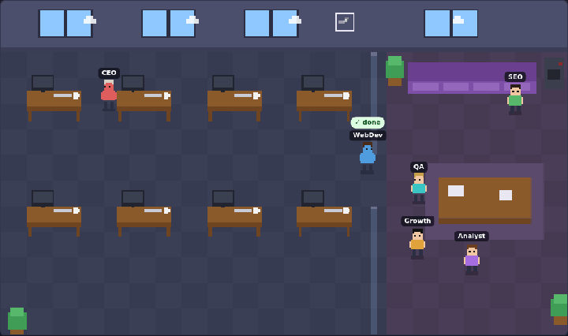

# Cubicle

**A live pixel-art office for your AI agents.** Works with [Paperclip](https://github.com/paperclipai/paperclip), [Claude Code](https://claude.com/claude-code), or any tool that can write a small JSON file.

**[▶ Live demo](https://caglarutkuguler.github.io/cubicle/?lang=en)** — no install, fake agents.

Your agents get a desk. When one starts working it walks over, sits down and starts typing, with its current task floating above its head. When it needs you, it raises a hand. When it finishes it goes back to the lounge for a coffee. If it hits an error, its screen flashes red.

[](https://caglarutkuguler.github.io/cubicle/?lang=en)

- **Zero dependencies.** One small Node.js file plus one HTML page. No build step, no image assets.
- **Read-only by design.** Cubicle only ever makes `GET` requests, and only to a short allowlist. It cannot change anything in your agent system.
- **Not tied to one platform.** Paperclip and Claude Code are built in; anything else plugs in through a [tiny JSON feed](docs/FEED.md).
- **Runs anywhere Node runs.** `npx`, a clone, a systemd unit, or a browser tab pointed at the hosted demo.
- **English and Turkish UI**, picked from your browser language or with `?lang=en` / `?lang=tr`.

## Quick start

Requires Node.js 18+.

**Paperclip** (default; expects Paperclip at `http://127.0.0.1:3100`):

```bash
npx github:caglarutkuguler/cubicle
```

**Claude Code** (one character per session, driven by Claude Code's own hooks; details in [`examples/claude-code/`](examples/claude-code/)):

```bash
npx github:caglarutkuguler/cubicle install-hooks      # once; backs up ~/.claude/settings.json first
npx github:caglarutkuguler/cubicle --source claude-code
```

**Anything else** — a JSON file or URL in the [feed format](docs/FEED.md):

```bash
npx github:caglarutkuguler/cubicle --source ./agents.json
npx github:caglarutkuguler/cubicle --source http://localhost:8080/agents
```

Then open <http://127.0.0.1:3200>. Nothing running yet? Open <http://127.0.0.1:3200/?demo>, or the [hosted demo](https://caglarutkuguler.github.io/cubicle/?lang=en).

Or from a clone:

```bash
git clone https://github.com/caglarutkuguler/cubicle.git
cd cubicle
node bin/cubicle.js            # add --source … as above
```

## Options

| Flag | Environment variable | Default |
| --- | --- | --- |
| `--port` | `CUBICLE_PORT` | `3200` |
| `--host` | `CUBICLE_HOST` | `127.0.0.1` |
| `--source` | `CUBICLE_SOURCE` | `paperclip` — or `claude-code`, a `.json` file, or an `http(s)://` URL |
| `--paperclip` | `PAPERCLIP_URL` | `http://127.0.0.1:3100` |

URL parameters:

- `?company=PREFIX` opens a specific Paperclip company (for example `?company=MEG`). With several companies, a picker also appears in the header.
- `?lang=en` or `?lang=tr` sets the language.
- `?demo` shows fake agents.

## What the office shows

| Status | In the office |
| --- | --- |
| `running` | Sits at its desk, monitor on, typing; bubble shows the task |
| `waiting` | Sits at its desk with a hand up, amber screen — it needs your input or approval |
| `idle` | Wanders the lounge; says "✓ done" right after finishing a run |
| `error` | Slumped at its desk, red screen, error text on its card |
| `paused` | "zZ" |

Each card below the office links to the agent's current task when the source provides a link (Paperclip issues do).

## Sources

**Paperclip.** Cubicle proxies three read-only endpoints (`/api/health`, `/api/companies`, `/api/companies/:id/agents|issues`) and maps Paperclip's agent status and open issues onto the office. Any adapter Paperclip supports — Claude Code, Codex, Cursor, HTTP agents — shows up, because the status comes from Paperclip itself. Targets the default `local_trusted` mode; authenticated deployments are not supported yet.

**Claude Code.** A hook script ([`bin/cubicle-hook.js`](bin/cubicle-hook.js)) runs on Claude Code's own hook events and rewrites `~/.cubicle/claude-code.json`. Tool calls put the character at its desk, permission prompts raise its hand, `Stop` sends it to the lounge. Setup and privacy notes: [`examples/claude-code/README.md`](examples/claude-code/README.md).

**Feed.** Any process can write `{ "company": "…", "agents": [{ "id", "name", "role", "status", "task", "error" }] }` to a file or serve it over HTTP. Full spec with status aliases: [`docs/FEED.md`](docs/FEED.md). A sample is in [`examples/feed.json`](examples/feed.json).

## Run it as a service (Linux / WSL)

systemd user units are in [`examples/systemd/`](examples/systemd/): `cubicle.service` (Paperclip, port 3200), `cubicle-claude.service` (Claude Code, port 3201), and an optional updater.

```bash
git clone https://github.com/caglarutkuguler/cubicle.git ~/cubicle
mkdir -p ~/.config/systemd/user
cp ~/cubicle/examples/systemd/*.service ~/cubicle/examples/systemd/*.timer ~/.config/systemd/user/
# edit ExecStart in cubicle*.service to point at your node binary (`command -v node`)
systemctl --user daemon-reload
systemctl --user enable --now cubicle.service cubicle-claude.service
```

**Stay up to date automatically.** `cubicle-update.timer` fast-forwards the clone every 10 minutes and restarts the running Cubicle services when something changed; open browser tabs reload themselves within a minute. It never touches a clone with local edits.

```bash
# link instead of copying, so updates to these two units arrive with the clone
systemctl --user link ~/cubicle/examples/systemd/cubicle-update.service ~/cubicle/examples/systemd/cubicle-update.timer
systemctl --user enable --now cubicle-update.timer
journalctl --user -u cubicle-update.service   # what it did
```

## Security notes

- Cubicle binds to `127.0.0.1` by default. Keep it that way unless you put it behind your own authentication, because anyone who can reach it can see your agent names, statuses and task titles.
- Only `GET` and `HEAD` are accepted; everything else gets `405`. In Paperclip mode only the three endpoints above are forwarded and any other `/api/` path gets `403`. In feed mode the only upstream request is a `GET` to the configured file or URL.
- The Claude Code hook never touches the network and stores only session id, directory name, status and a short summary of the current tool call.

## How it works

`bin/cubicle.js` serves `public/index.html` and either proxies the allowed Paperclip endpoints or serves the feed at `/api/feed`. The page polls every 4 seconds and draws everything, including characters, furniture and the day/night windows, on a 352×208 canvas with plain rectangles.

## Contributing

Issues and pull requests are welcome. Ideas: adapters for other agent runtimes (write a feed, send a PR with an example), a kiosk mode for wall displays, meeting-room animations when agents hand work to each other, per-agent sprite customisation, replay of a recorded day, and support for authenticated Paperclip deployments.

## Credits

Inspired by the idea behind [Pixel Agents](https://github.com/pixel-agents-hq/pixel-agents) by Pablo De Lucca. Cubicle is an independent implementation and uses no code or assets from it.

Cubicle is a community project and is not affiliated with or endorsed by Paperclip Labs or Anthropic.

## License

[MIT](LICENSE)

---

### Türkçe

**Cubicle**, AI ajanlarınızı canlı bir pixel ofiste gösterir: [Paperclip](https://github.com/paperclipai/paperclip) ve Claude Code hazır gelir; başka sistemler küçük bir [JSON feed](docs/FEED.md) ile bağlanır. Çalışan ajan masasına oturup yazar ve başının üstünde görevi görünür; sizi bekleyen ajan elini kaldırır; işi biten ajan dinlenme alanına döner; hata alan ajanın ekranı kırmızı yanar.

Kurulum: `npx github:caglarutkuguler/cubicle` (Paperclip) veya `npx github:caglarutkuguler/cubicle --source claude-code` (Claude Code) çalıştırın ve <http://127.0.0.1:3200> adresini açın. Kurmadan denemek için: [canlı demo](https://caglarutkuguler.github.io/cubicle/?lang=tr). Arayüz tarayıcı diline göre Türkçe açılır; `?lang=tr` ile de seçilebilir.
